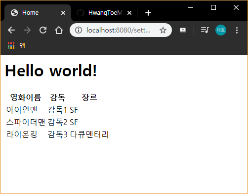
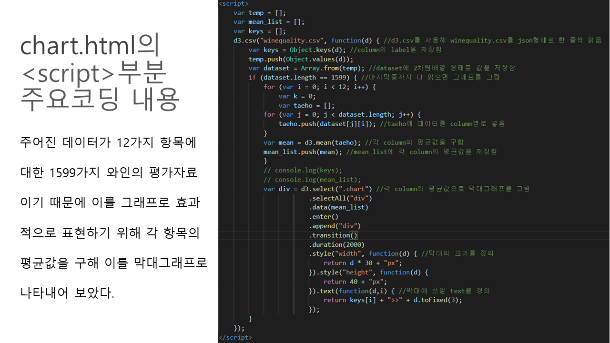
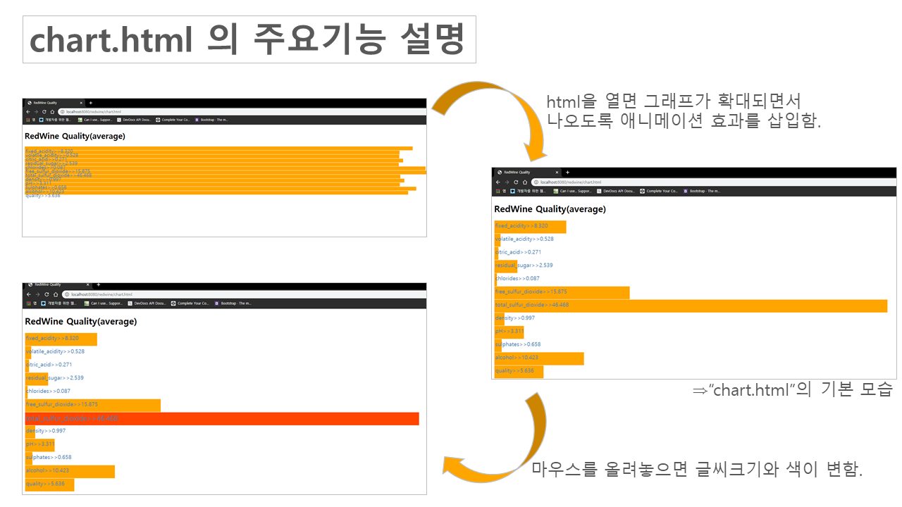
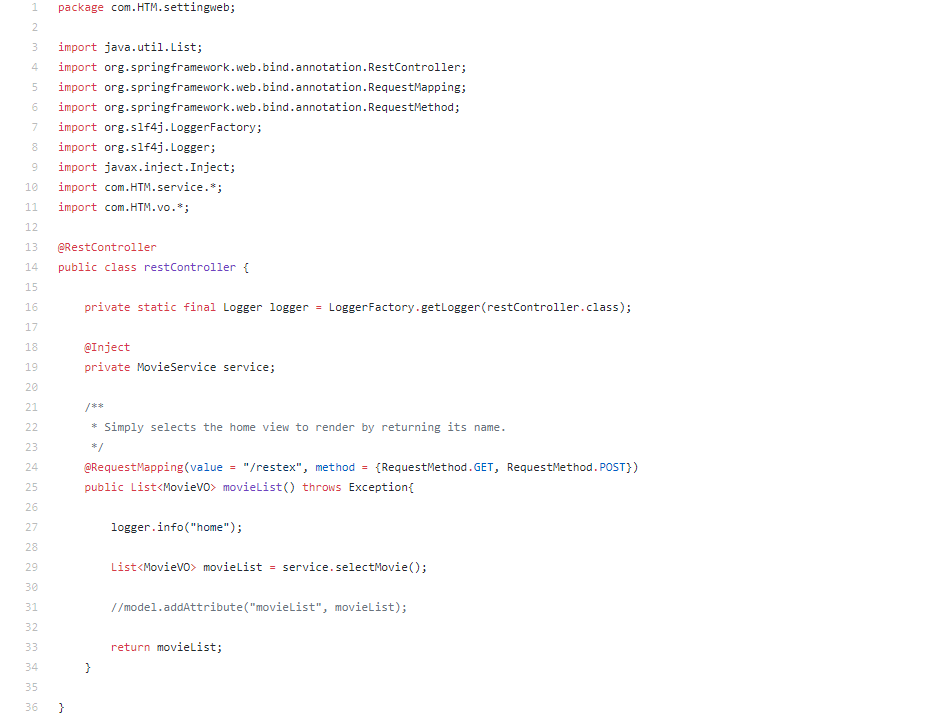
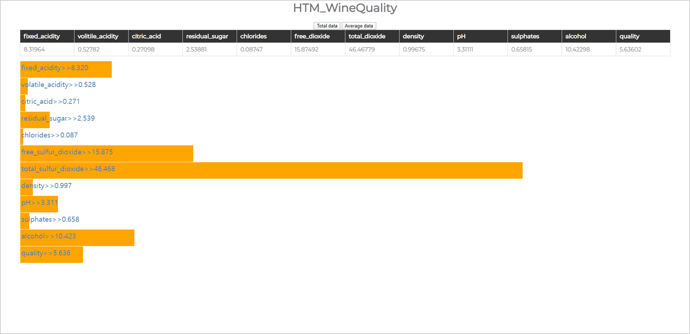

# Build a Web with "spring"
## 1. Setting Web

## 2. Made chart with d3.js

## 3. Data binding with restController

## 4. Final website
### * If you click "TotalData", you can get all of the "WineQuality_data".

### * If you click "AverageData", you can get average of the "WineQuality_data".

