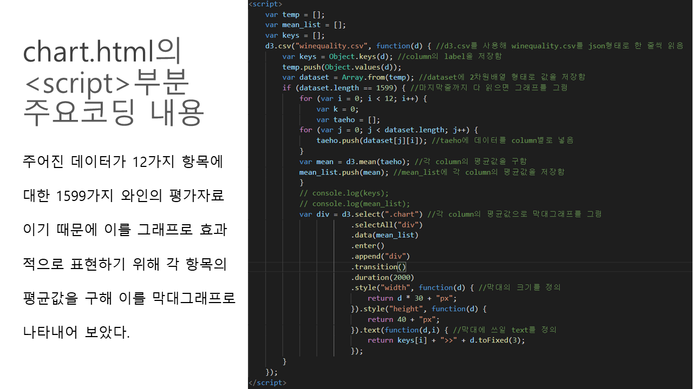
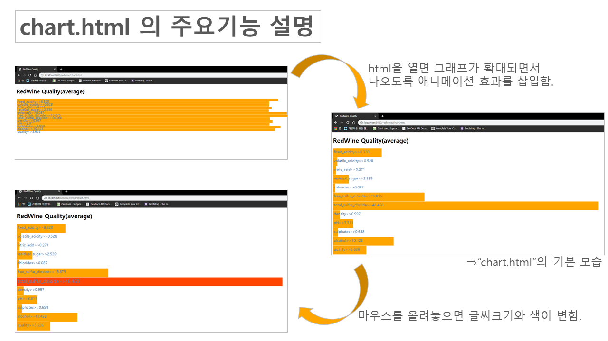

# Backend-Practice
Practice Django, Spring, Spring Boot....
## 1. Spring
### main fuction of this web
Receive the Wine quality data from DB, show the data in graph.

### * If you click "TotalData", you can get all of the "WineQuality_data".

### * If you click "AverageData", you can get average of the "WineQuality_data".

