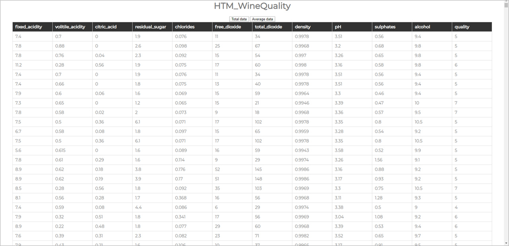
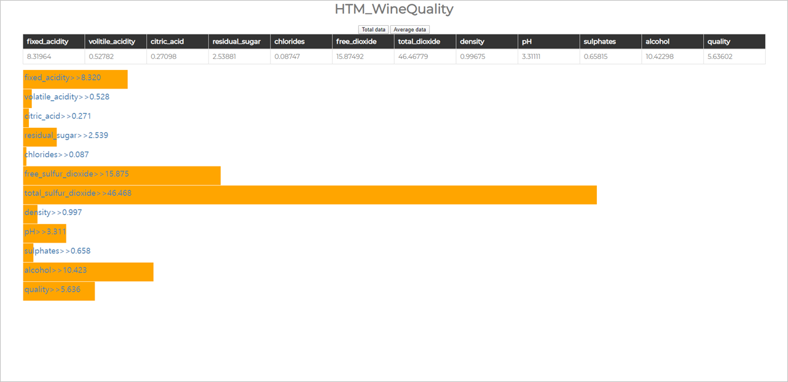
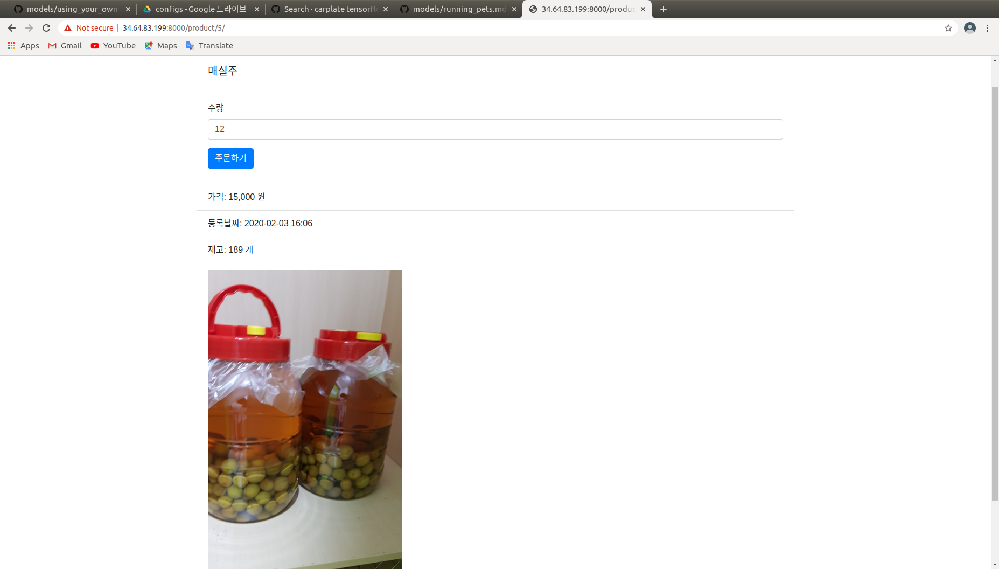

# Backend-Practice 
Practice Django, Spring, Spring Boot....
## 1. Spring
### main fuction of this web
Receive the Wine quality data from DB, and show the average of data.
### * If you click "TotalData", you can get all of the "WineQuality_data".

### * If you click "AverageData", you can get average of the "WineQuality_data".

## 2. Django
### 1. Make my website

This site has implemented membership , login, and bulletin board functions.
You can click this link to view the site. [Mywebsite](https://xoghsms.pythonanywhere.com)

### 2. Second website(HTM_Mall)

Htm_Mall is a site that embodies major functions of internet shopping malls.

[main page]
http://34.64.83.199:8000/

[login page]
http://34.64.83.199:8000/login/

[logout function]
http://34.64.83.199:8000/logout/

[register membership page]
http://34.64.83.199:8000/register/

[product list page]
http://34.64.83.199:8000/product/

[product reigister page](Administer Only)
http://34.64.83.199:8000/product/create/

[order list page]
http://34.64.83.199:8000/order/

